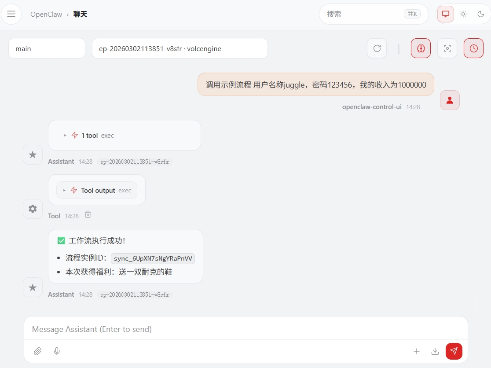

# Openclaw集成Juggle技能

openclaw作为超级智能体，受到了越来越多的人的喜爱，国内也出了非常多的类似产品，这些智能体都得益于skill的能力，通过渐进式披露的方式，让大模型通过少量的上下文大模型就能准确的执行相关的任务，相对老一代的智能体确实强大了非常多，但是目前openclaw等类似产品仍然存在一些痛点。

- **非常烧token**

  虽然随着大模型的不断发展，token调用的费用在不断降低，openclaw由于内置工具和本身机制的原因，在实际使用的过程中，会向上下文中添加大量的内容，token的消耗是非常大的，对于很多个人用户来说成本还是有点高的。

- **缺乏稳定性**

  openclaw类似的产品本身没有突破性的创新，本质还是将已经成熟的一下技术（如：skill，mcp等）整合到一起后的产品，由于大模型的参与，导致还是会存在无法触发或者触发不正确的情况，因此对于稳定性要求非常高的场景就并不适合直接使用。

  

juggle skill这个技能主要是为了解决openclaw上述的两个痛点，用户将自己的业务场景在juggle上设计成一个流程,并将流程元数据配置到juggle skill上，然后就能在openclaw中触发对于的业务场景了，有了juggle skill后，我们就不用装那么多的其他skill了，token的使用自然就会大大降低，同时流程是绝对稳定的，对于需要高确定性的场景就非常适合。


下面详细介绍一下juggle技能的安装流程，让我们在享受openclaw带来便捷性的同时，同时满足严谨业务流程的场景需求。

### 1.安装juggle skill

通过下面的命令安装juggle技能

```xml
npx clawhub@latest install juggle
```

或者直接下载juggle的技能zip包进行安装，[juggle技能下载地址](https://clawhub.ai/somta/juggle)

### 2.配置域名和认证令牌

juggle skill在运行的时候会依赖两个两个环境变量，分别是juggle服务部署的域名和流程访问的认证令牌，认证令牌的创建方式如下图所示


完成令牌的创建后，需要在openclaw.json配置文件中设置相关的环境变量，代码如下所示

```json
"skills": {
    "entries": {
      "juggle": {
        "env": {
           "MC_JUGGLE_BASE_URL": "你的juggle部署域名",
           "MC_JUGGLE_TOKEN": "你的juggle认证令牌"
        },
      }
    }
```

修改完成后运行下面的命令重启openclaw

```
openclaw gateway restart
```

### 3.调用示例流程

完成上面的配置后，就可以在openclaw中试调用官方skill内置的示例流程了，在openclaw中输入**“调用示例流程 用户名称juggle，密码123456，我的收入为1000000”**，成功触发了示例流程，并输出了正确的调用结果，如下图所示




### 4.配置自己的工作流程

通过上面的步骤，已经完成了示例流程调用，juggle skill官方skill中内置了官方示例流程的元数据，如果你希望自己的设计好的流程也能在juggle skill上被识别到，并被调用，可以在flow_spec.md将自己流程的元数据信息（包括流程版本，流程key，触发地址，流程的出入参）添加进行即可，具体格式和内容可以参考如下


### 1. 同步示例工作流

#### 基本信息
- **流程版本**: v1
- **流程 Key**: sync_example
- **流程类型**: sync（同步流程）
- **触发地址**: `{BASE_URL}/open/v1/flow/trigger/v1/sync_example`

#### 入参说明

| 参数名 | 类型 | 是否必填 | 描述 |
|--------|------|----------|------|
| userName | String | 必填 | 用户名 |
| password | String | 必填 | 密码 |
| deposit | Integer | 必填 | 存款金额 |

**入参示例**:
```json
{
    "flowData": {
        "userName": "juggle",
        "password": "123456",
        "deposit": 666
    }
}
```

#### 出参说明

| 参数名 | 类型 | 描述 |
|--------|------|------|
| success | Boolean | 是否成功 |
| errorCode | String | 错误码 |
| errorMsg | String | 错误信息 |
| result | Object | 流程执行结果 |
| - flowType | String | 流程类型（sync/async） |
| - flowInstanceId | String | 流程实例 ID |
| - status | String | 流程状态（FINISH/ABORT/RUNNING） |
| - data | Object | 流程返回数据 |
| -- userName | String | 用户名 |
| -- age | String | 年龄 |
| -- orderName | String | 订单名称 |

**出参示例**:
```json
{
    "success": true,
    "errorCode": "0",
    "errorMsg": null,
    "result": {
        "flowType": "sync",
        "flowInstanceId": "sync_fYCVeFNzrvwe4k8Z",
        "status": "FINISH",
        "data": {
            "userName": "juggle",
            "age": "18",
            "orderName": "送10元话费"
        }
    }
}
```

#### 调用示例

**命令行调用**:
```bash
python /workspace/projects/juggle/scripts/flow.py trigger \
  --flow-version "v1" \
  --flow-key "sync_example" \
  --flow-data '{"userName": "juggle", "password": "123456", "deposit": 666}'
```

**预期输出**:
```
[触发流程] 正在触发流程...

[触发结果]
{
  "success": true,
  "errorCode": "0",
  "errorMsg": null,
  "result": {
    "flowType": "sync",
    "flowInstanceId": "sync_fYCVeFNzrvwe4k8Z",
    "status": "FINISH",
    "data": {
      "userName": "juggle",
      "age": "18",
      "orderName": "送10元话费"
    }
  }
}

[同步流程] 执行完成
```


