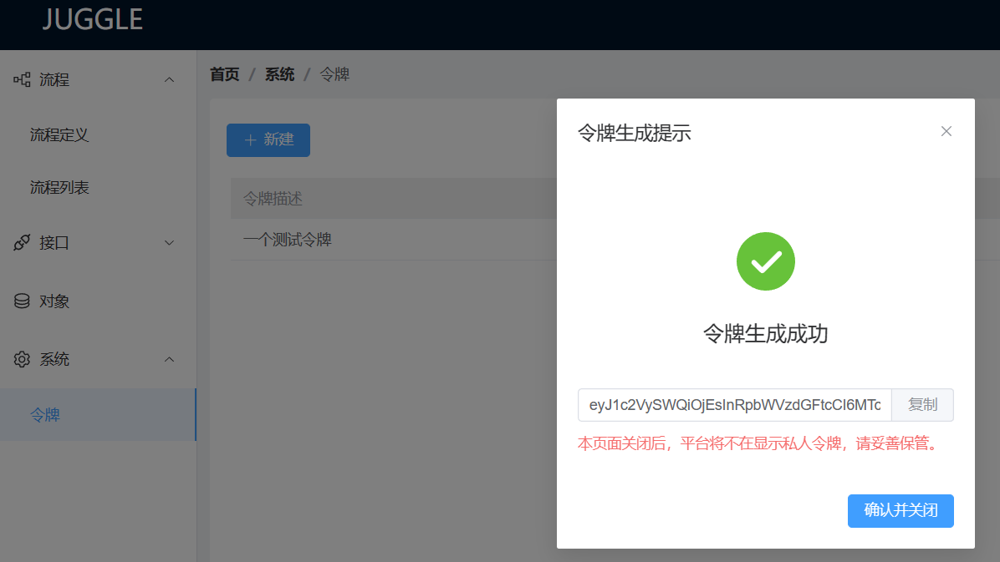

# 普通Java项目集成Juggle

Nodejs项目也能快速接入Juggle的流程，我们也提供了对应的client，通过该client就能快速接入和触发流程，具体接入步骤如下：

### 1.安装依赖

```sh
# npm
npm install juggle-client
# or yarn
yarn add juggle-client
# or pnpm
pnpm i juggle-client
```

### 2.登录Juggle，申请一个令牌



### 3.通过juggleClient调用流程接口

```js
// 引入 pkg
const JuggleClient = require('juggle-client');

// 配置信息
const serverAddr = 'https://demo.juggle.plus';
const accessToken = 'eyJ1c2VySWQiOjEsInRpbWVzdGFtcCI6MTcyOTAwODYzOTc5MH0=';

// 实例初始化
const juggleClient = new JuggleClient({
  accessToken,
  serverAddr,
});

async function triggerJuggleFlow() {
  const res1 = await juggleClient.triggerFlow('v1', 'sync_example', {
    userName: 'juggle',
    password: '123456',
    deposit: 1000,
  });
  console.log(res1);

  const res2 = await juggleClient.getAsyncFlowResult('222');
  console.log(res2);
}

triggerJuggleFlow();
```

### 4.juggleClient提供方法介绍

#### a.触发流程方法  - triggerFlow

**入参**

| 名称        | 类型   | 是否必填 | 描述                                             |
| ----------- | ------ | -------- | ------------------------------------------------ |
| flowVersion | String | 必填     | 流程版本                                         |
| flowKey     | String | 必填     | 流程Key                                          |
| triggerData | Object | 非必填   | 流程定义中的入参数据，如果流程没有入参，可以不填 |
| - flowData  | Map    | 非必填   | 触发流程需要的参数数据                           |

**出参**

| 名称             | 类型    | 描述                                       |
| ---------------- | ------- | ------------------------------------------ |
| success          | Boolean | 是否成功                                   |
| errorCode        | Long    | 错误码                                     |
| errorMsg         | String  | 错误信息                                   |
| result           | Object  | 流程定义中设置的出参结果                   |
| - flowInstanceId | String  | 流程触发后的实例ID                         |
| - status         | String  | 流程的执行状态                             |
| - data           | Map     | 流程返回的实际数据，即流程定义中定义的出参 |


#### b.获取异步流程方法 - getAsyncFlowResult

**入参**

| 名称           | 类型   | 是否必填 | 描述           |
| -------------- | ------ | -------- | -------------- |
| flowInstanceId | String | 必填     | 异步流程实例ID |

**出参**

| 名称      | 类型    | 描述                     |
| --------- | ------- | ------------------------ |
| success   | Boolean | 是否成功                 |
| errorCode | Long    | 错误码                   |
| errorMsg  | String  | 错误信息                 |
| result    | Map     | 流程定义中设置的出参结果 |