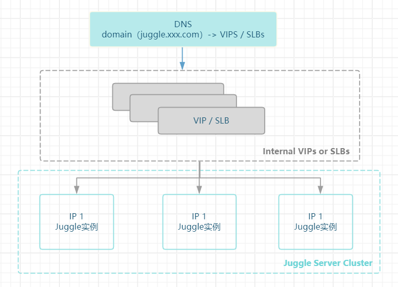

集群模式主要用于生产环境，要确保Juggle服务的高可用、高扩展、高并发等要求，确保在单节点故障发生时不影响业务的运行。故提出以下几点要求

1. Juggle要多实例部署
2. 中间件切换为MySql数据库，Redis缓存这种具有更高可用性的中间件
3. 使用域名访问Juggle，不要直连IP，避免单机器宕机后，ip变动导致的问题

集群模式下，架构图如下所示

具体切换MySql数据库和Redis缓存的方法可以参考Juggle单机部署的方法 [单机模式部署](https://juggle.plus/docs/guide/operation/deployment-standalone)

:::warning

集群模式下存在多个Juggle实例，不能使用内置H2数据库存储数据，要切换成Mysql等高可用的数据库；也不能使用内置缓存，要切换为Redis缓存，
因为多实例下使用各自的内存缓存，会导致缓存中的流程结果混乱。

:::