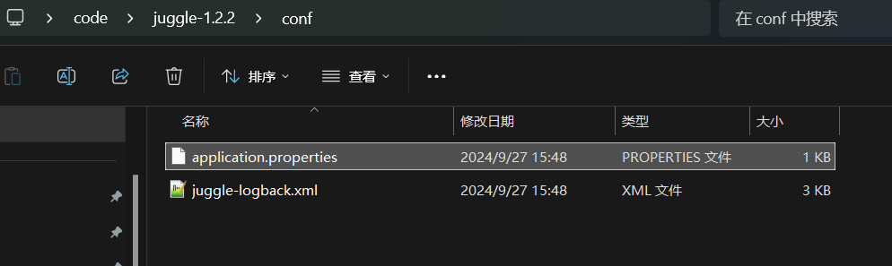

在快速开始章节，我们使用内置的H2数据库，通过多种方式快速部署了Juggle的单机模式，可以参考使用H2数据库的Juggle单机模式部署：[宿主机单机模式部署](https://juggle.plus/docs/guide/start/quick-start) ，[Docker单机模式部署](https://juggle.plus/docs/guide/start/start-with-docker)。

### 1.使用内置H2数据库

单机模式使用内置数据库和内存缓存，这是Juggle最简的部署方式，这种部署方式不依赖任何中间件，部署起来非常简单，具体部署方式可以参考：[宿主机单机模式部署](https://juggle.plus/docs/guide/start/quick-start) ，[Docker单机模式部署](https://juggle.plus/docs/guide/start/start-with-docker)。


### 2.使用外置MySql数据库和Redis缓存

对于测试环境或者稳定性要求不高的场景，又需要更好的保存数据时，就可以将内置H2数据库换成MySql等数据库，将内存缓存缓存Redis缓存。

#### a.切换Mysql数据库

1）执行建表语句和初始数据

建表语句地址：[MySql建表语句](https://github.com/somta/Juggle/blob/master/console/src/main/resources/db/schema.sql)

初始数据地址：[MySql初始化语句](https://github.com/somta/Juggle/blob/master/console/src/main/resources/db/data.sql)

2）修改application.properties配置文件配置，启用Mysql的连接信息

```properties
##H2##
#spring.datasource.driver-class-name=org.h2.Driver
#spring.datasource.url=jdbc:h2:file:./console/src/main/resources/data/db_juggle;MODE=MYSQL;DB_CLOSE_DELAY=-1;DATABASE_TO_UPPER=false;IGNORECASE=TRUE;AUTO_SERVER=TRUE;OLD_INFORMATION_SCHEMA=TRUE
#spring.datasource.username=sa
#spring.datasource.password=juggle
#spring.h2.console.enabled=true
#spring.h2.console.settings.web-allow-others=true
#spring.h2.console.path=/h2-console

##注释上面内置H2数据库配置，放开MySql配置##
spring.datasource.driver-class-name=com.mysql.cj.jdbc.Driver
spring.datasource.url=jdbc:mysql://127.0.0.1:3306/juggle?useUnicode=true&characterEncoding=utf-8&serverTimezone=Asia/Shanghai&useSSL=false
spring.datasource.username=root
spring.datasource.password=123456
```

#### b.切换Redis缓存

修改application.properties配置文件配置，启用Redis的配置信息

```properties
##启用Redis的配置##
juggle.cache.cache-type="redis"
juggle.cache.redis.model="single"
juggle.cache.redis.address=127.0.0.1:6379
juggle.cache.redis.password=
```

### 3.使用修改后的配置文件

#### a.宿主机单机部署

window或linux上宿主机的单机部署，直接修改config目录下的application.properties中的配置即可，如下图所示位置的配置文件




#### b.Docker单机部署

docker部署的时候，直接使用挂载的方式覆盖容器内部的配置文件即可，具体命令如下

```yaml
version: '3'
services:
  juggle:
    image: somta/juggle:latest
    container_name: juggle
    ports:
      - "9127:9127"
    volumes:
      - ./conf/application.properties:/home/juggle/conf/application.properties
```

