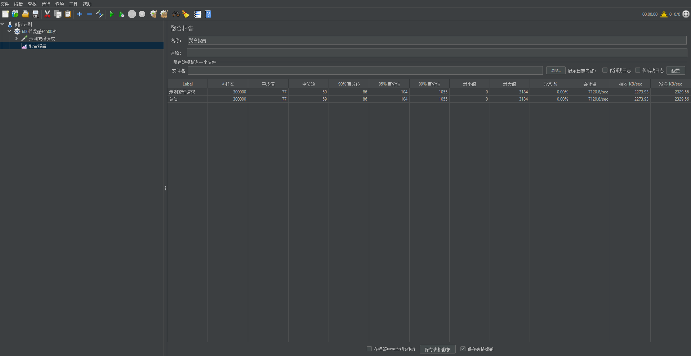
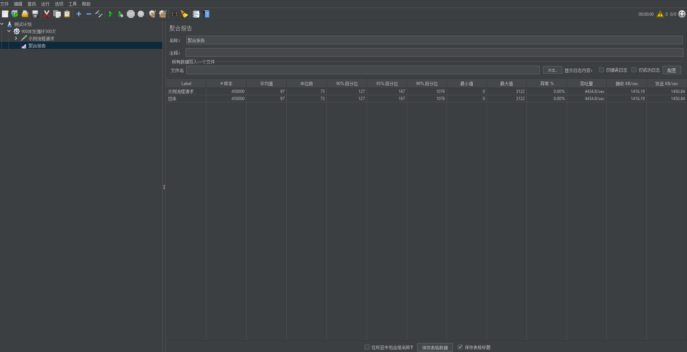

### 1.性能测试背景

Juggle作为一个底层的编排框架，在性能方面我们有这极致的追求，对于引擎的核心代码，我们进行过逐行的性能优化，精益求精，在流程执行的过程中对系统几乎没有额外的性能消耗，最终做到了流程本身的耗时普遍在10-20毫秒。

Juggle在实际场景中的执行效率也非常高，在落地的公司核心场景中，单节点的性能也能达到1600的TPS，集群下能达到1W以上的TPS，经过多家大型公司的流量验证。

虽然Juggle框架本身性能很好，但是整体的执行效率却依赖套件中实际接口的快慢，如果业务接口本身就比较慢，通过Juggle进行编排后，流程的TPS也不会高，这是业务接口本身的性能问题，不是Juggle框架的性能问题，因此需要提高整体流程的性能，还需要框架和接口共同努力提高性能，才能达到一个最好的效果。

### 2.性能工具与配置

| 环境     | 参数                                                  |      |
| -------- | ----------------------------------------------------- | ---- |
| 压测工具 | JMeter 5.6                                            |      |
| 镜像     | Juggle官方Docker镜像                                  |      |
| 配置     | 镜像分配4核4G的内存，SpringBoot默认采用Tomcat作为容器 |      |

### 3.性能压测案例

性能压测采用大家最熟悉的官方[示例流程](https://juggle.plus/docs/guide/user/example-flow/)进行压测，示例流程包含8个节点，其中包含3个方法节点，2个判断节点，基本符合一个常见的业务流程需求，其中示例流程中的接口不调用真实接口，走接口的数据mock，但是流程日志，流程节点日志都会正常记录，采用官方的Docker镜像进行性能测试，并给镜像分配4核4G的配置进行压测实验（**如果采用更高配置或多副本集群部署性能更好**），具体的压测结果如下

#### a.300线程，并发循环500次

#### b.600并发，循环500次

#### c.900并发，循环500次

