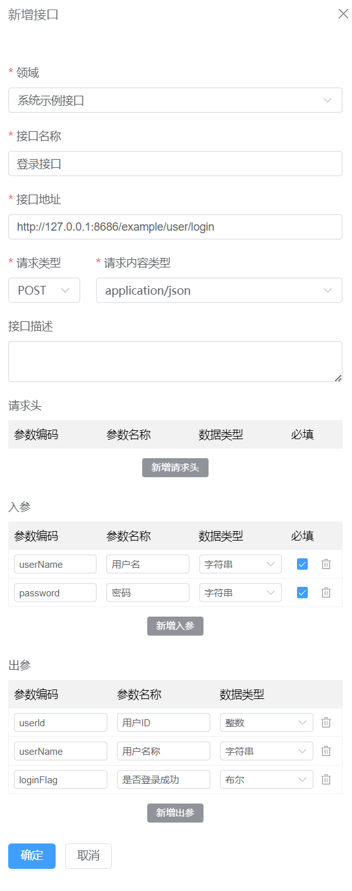
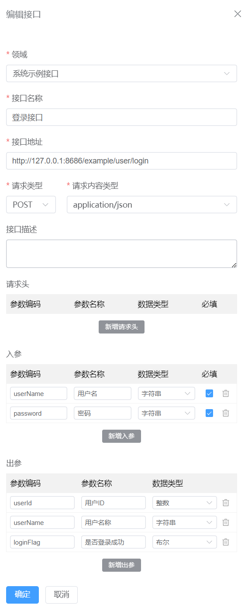

# 接口

接口是流程设计时使用的最小单元之一，主要用来承载各种不同的api接口，接口可以通过手动创建，业务服务推送自动创建，Juggle主动拉起自动创建等创建来源。

### 创建接口

1.在"**接口**" > "**接口列表**" 页面，点击“**新建**”按钮

2.在右侧弹出的抽屉中，完成**套件**，**接口名称**，**接口地址**，**请求类型**，**请求内容类型**，**接口描述**（非必填），**接口入参**（非必填），**接口出参**（非必填）

3.点击**确定**按钮，创建接口

请求类型支持：**GET**, **POST**, **PUT**, **DELETE**

请求体类型支持: **application/json**, **application/x-www-form-urlencoded**

数据类型支持：[Juggle支持的数据类型](/docs/guide/user/data-type-info/)

### 修改接口

1.在"**接口**" > "**接口列表**" 页面，点击“**新建**”按钮

2.在右侧弹出的抽屉中，完成**套件**，**接口名称**，**接口地址**，**请求类型**，**请求内容类型**，**接口描述**（非必填），**接口入参**（非必填），**接口出参**（非必填）

3.点击**确定**按钮，修改接口

### 删除接口

1.在"**接口**" > "**接口列表**" 页面，点击“**删除**”按钮

2.在二次确认弹框中，再次点击“**确定**”按钮

:::info
删除接口并不会影响已经在流程设计中和已经上线的流程对该接口的使用，只是删除后，后续在进行流程设计的时候就选不到该接口了。
:::