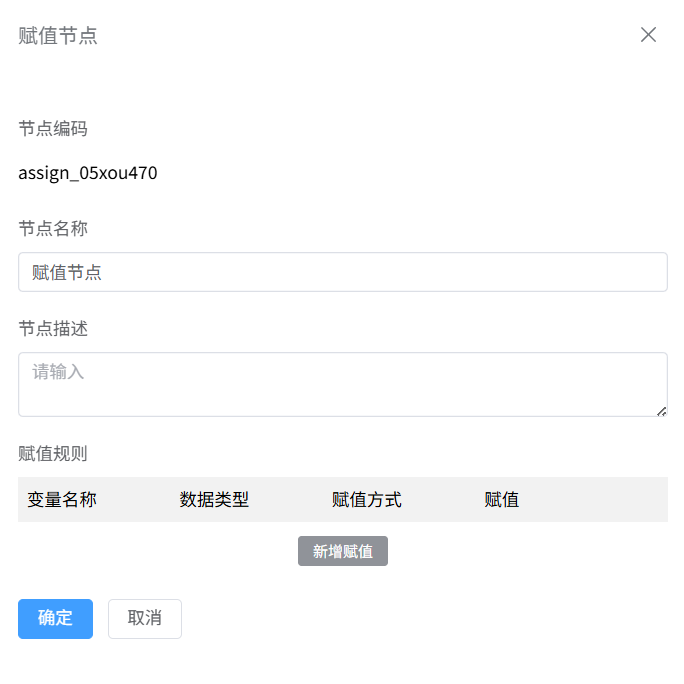

# 赋值节点
赋值节点主要是来用户根据业务场景的需求，在不同的分支条件下对同一变量赋予不同的值，以满足不同的业务场景的赋值的需要。

### 节点介绍

1.点击“+”，选择赋值节点

2.在代码节点页面，输入**节点名称**，**自定义代码**，点击**“确定”**按钮

### 功能介绍

赋值节点主要是给中间变量，出参变量进行变量赋值，赋值来源主要包括常量，其他中间变量，其他接口出参等三种情况，最终达到不同分支条件下给同一个变量赋值不同值的目的。

