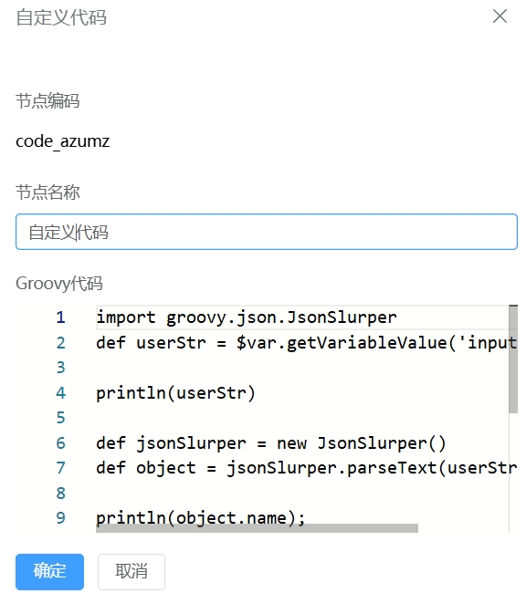

# 代码节点
代码节点主要是来用户自定义的代码，即可以在流程设计过程中添加一个代码节点，可以通过这些代码完成变量的组装转换，业务逻辑增强，数据清洗等工作，代码节点将极大的提升Juggle编排的灵活性

### 节点介绍

1.点击“+”，选择代码节点

2.在代码节点页面，输入**节点名称**，**自定义代码**，点击**“确定”**按钮



### 功能介绍

#### a.支持脚本代码

Juggle的代码节点支持Groovy，JavaScript，Python，Java等多种语言代码。

#### 1.Groovy示例

##### a.在Groovy代码中获取和设置流程变量

在代码节点中可以通过$var.getVariableValue('变量键')来获取变量；通过$var.setVariableValue('变量键',数据)来给指定的变量赋值

```groovy
//获取入参变量input_name
def userName = $var.getVariableValue('input_name')
//将出参变量的值设置成6666
$var.setVariableValue('output_userName',6666)
```

##### b.在Groovy代码中使用Json库

Juggle的Groovy引擎也引入了JsonSlurper库，方便在代码中进行字符串和对象的相关操作，关于JsonSlurper的使用介绍可以参考[JsonSlurper使用详解](https://cloud.tencent.com/developer/section/1491433)。

```groovy
import groovy.json.JsonSlurper
//获取流程变量字符串
def userStr = $var.getVariableValue('input_user')
//实例化一个json对象
def jsonSlurper = new JsonSlurper()
// 将字符串反序列化成对象
def user = jsonSlurper.parseText(userStr) 
//打印user对象的name属性
println(user.name);
```

**Groovy新手教程：**https://cloud.tencent.com/developer/chapter/18236


#### 2.JavaScript示例

在代码节点也允许通过JavaScript脚本来增强流程的能力，下面将详细介绍如何使用JavaScript脚本

##### a.在JavaScript代码中获取和设置流程变量

在JavaScript脚本中通过$var.getVariableValue('变量key')来获取具体的变量，通过$var.setVariableValue('变量key',值);来对变量进行赋值。

```javascript
// 获取变量
// var env_name = $var.getVariableValue('变量key');
// 设置变量
// $var.setVariableValue('变量key',值);

//例子如下：
//获取入参变量input_name
var userName = $var.getVariableValue('input_name')
//将出参变量的值设置成6666
$var.setVariableValue('output_userName',6666)
```