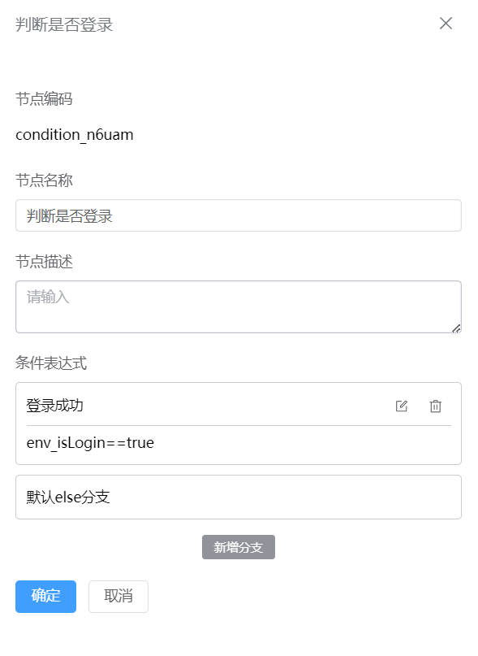
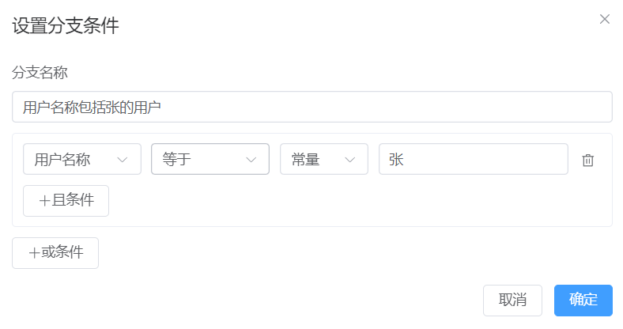

# 判断节点
判断节点是用来承载判断条件的，一个判断节点会有多个分支，默认会有一个else分支，每个分支之间是互斥的，从左往右依次执行，第一个命中的分支将会被触发，如果都没命中就会进入默认的else分支。

### 节点介绍

1.点击“+”，选择判断节点

2.在代码节点页面，输入**节点名称**，**节点描述**等信息

3.点击**新增分支**按钮，输入**分支名称**，**分支条件**，点击**“确定”**按钮

### 功能介绍

#### a.条件执行逻辑

多个判断条件是排它的，从左到右依次匹配，匹配到对应的条件后就会进入命中的分支逻辑，多个分支条件的循序可以在判断节点的面板调整，来调整条件匹配的优先级。

判断节点的判断条件只能由一个或多个变量组成，多个变量和条件之间可以自由的进行且或组合，每种数据类型的变量支持的[表达式](/docs/notes/guide/user/data-type-info#数据类型支持的表达式)是不一样，可以用于条件判断的变量有入参变量，出参变量，中间变量，具体变量的赋值来源可以参考[变量](/docs/notes/guide/user/design/variable)章节。