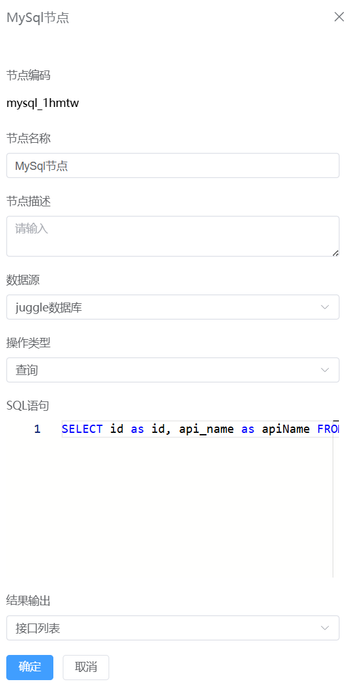
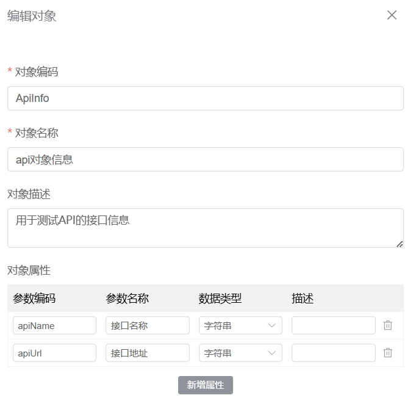

# MySql节点


### 节点介绍
1.点击“+”，选择判断节点

2.在代码节点页面，输入**节点名称**，**节点描述**，**数据源**，**操作类型**，**SQL语句**等信息，点击**“确定”**按钮



### 功能介绍

#### a.数据源
数据源是为SQL执行提供环境，数据源内部还提供了链接池，连接数， 查询超时等多项设置。

可以在"**设置**" > "**数据源**"，新增数据源，目前暂时只支持MySql的数据源，后续还会支持ES，Redis等更多的数据源。


#### b.操作类型

执行一个SQL语句主要分为两大类，一类为不太关心执行结果的更改类型的sql语句，如：insert，update，delete；一类为关心结果的查询类型的sql语句，如：query；在流程设计过程中不同类型的操作逻辑会有较大差别，因此我们单独设置了一个选型来区分不同类型


#### c.SQL语句

理论上所有mysql支持的sql语句，都能用在mysql节点，通过这些sql语句能完成普通业务服务所有SQL相关的能力，sql语句中支持插入入参变量，中间变量等，使用时语法参考freemarker即可

1）查询数据

```
select api_name as apiName, api_url as apiUrl from t_api
```

:::warning
在查询数据的时候需要保证查询的列名称与接受数据的对象的属性参数编码相同，如上面sql对应的接口列表中，接口对象的定义如下图所示

:::


2）新增/修改/删除数据

```sql
INSERT INTO t_user (age, name) VALUES (${input_age}, '${input_name}');
```

:::warning
如果引入的变量是一个字符串时,sql中在使用变量的时候需要在变量外面加上单引号，如下面的例子中name是一个字符串，使用入参变量input_name时在括号外面加上了单引号
INSERT INTO t_user (age, name) VALUES (${input_age}, '${input_name}');
:::

#### d.结果输出

查询场景时，支持将查询的结果输出给一个变量，输出的变量给后续流程使用，配置人员需自行保证其查询结果数据类型与所定义变量的数据类型匹配