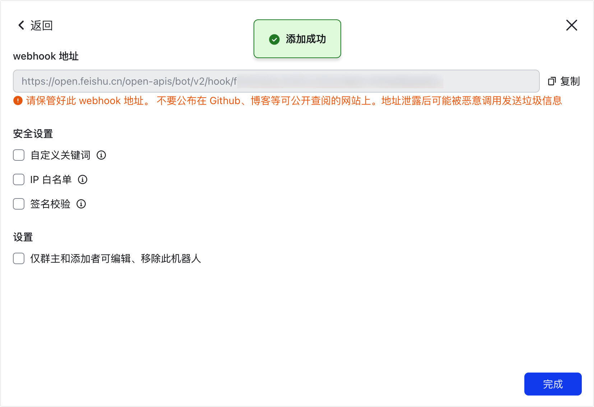
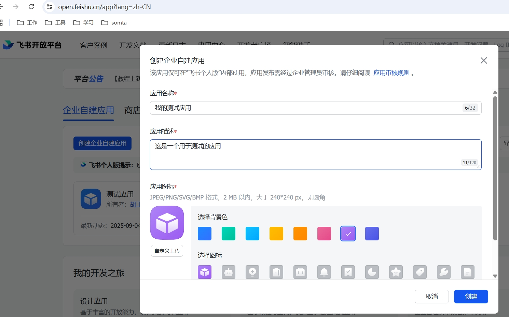

飞书自定义机器人套件是官方推出的一个套件，飞书自定义机器人是一个非常方便的应用，它能将外部的业务数据、监控报警、 群通知等通过组装推送到特定群，达到自动通知的目的。在Juggle中可以通过飞书自定义机器人的通知能力，将飞书和我们自身的系统应用结合，从而更好地保障我们系统的稳定运行或提高我们的工作效率。通知能力包含: 文本通知、富文本通知、图片通知、群分享。为了更方便使用自定义机器人, 调用推送的一些相关信息如token, user_id或open_id,image_key的获取接口我们也整合好了,只需要拿到相关的appId和appSecret就可以进行自定义机器人的调用了.


# 使用指南

## 自定义机器人调用前置条件: 
- 需要在群聊中添加自定义机器人, 获取到webhookUrl
  
- 按需 前往[飞书开放平台](https://open.feishu.cn/)创建一个自建应用, 获取到appId和appSecret(用于获取用户id或imageKey)

 
## 套件接口:

| 接口                      | 请求方法 | 请求路径                                                | header | query           | body                                                                                                                                                                                   | response                                                                                                            |
|-------------------------|------|-----------------------------------------------------|--------|-----------------|----------------------------------------------------------------------------------------------------------------------------------------------------------------------------------------|---------------------------------------------------------------------------------------------------------------------|
| 获取tenant_access_token接口 | POST | /suite/v1/fei-shu/info/tenant_access_token/internal |        |                 | {appId: string, appSecret: string                                                                                                                                                      | {"feishuToken": "t-g1049rlrTX67RIT5XJ2R2F3FXVW5JZWS3LBN6DTH"}                                                       |
| 获取image_key             | POST | /suite/v1/fei-shu/info/image_key                    | feishuToken: string | form-data: file |                                                                                                                                                                                        | {"image_key": "xxxxxxx"}                                                                                            |   
| 获取用户ID或openId           | POST | /suite/v1/fei-shu/info/getUserOrOpenId              |   feishuToken: string |                     | {"emails":["restfulToolkitX"],"mobiles":["restfulToolkitX"],"includeResigned":true,"userType":"restfulToolkitX"}                                                                       | {"code":0,"data":{"user_list":[{"mobile":"15000000000","user_id":"ou_3f32c7e641bvvxxxxxx31350c"}]},"msg":"success"} |                                |
| 发送文本                    | POST | /suite/v1/fei-shu/robot/sendText                    |                       |                     | {"webhookUrl":"http://1222","signSecret":"aaa" ,"text":"addd"}                                                                                                                         |                                                                                                                     |
| 发送图片                    | POST | /suite/v1/fei-shu/robot/sendImage                   |                       |                     | {"webhookUrl":"http://1222","signSecret":"aaa" ,"imageKey":"addd"}                                                                                                                     |                                                                                                                     |
| 发送群分享                   | POST |  /suite/v1/fei-shu/robot/shareChatId                  |                       |                     | {"webhookUrl":"http://1222","signSecret":"aaa" ,"shareChatId":"addd"}                                                                                                                  |                                                                                                                     |
| 发送富文本                   | POST     |    /suite/v1/fei-shu/robot/shareChatId        |                       |                     | {"webhookUrl":"https://o1111","lang":"zh_cn","title":"wo shi title","tagListList":[[{"tag":"text","text":"wo shi text"},{"tag":"a","text":"wo shi href","href":"https://feishu.cn"}]]} |                                                                                                                     |


上诉接口的参数说明如下:
  富文本参数除外, 富文本参数前往飞书文档

| 参数           | 说明                             |
|--------------|--------------------------------|
| appId        | 自建应用的appId                     |
| appSecret    | 自建应用的appSecret                 |
| feishuToken  | 通过appId和appSecret获取到的T,ken，2小时有效期 |
| emails       | 用户邮箱集合                         |
| mobiles      | 用户手机号集合                        |
| includeResigned | 是否获取离职用户                       |        
| user_type    | 取值user_id，open_id, 默认open_id   |
| webhookUrl   | 在指定群聊中添加群自定义机器人后获取到的webhookUrl |
| signSecret   | 消息安全策略如果需要签名验证,要传递的密钥          |
| text         | 文本消息                           |
| imageKey     | 飞书的内网图片的key                    |
| shareChatId  | 飞书的群id                         |
| lang         | 富文本的语言，zh_cn, en_us,默认zh_cn    |
| title        | 富文本的标题                         |
| tagListList             | 富文本的内容标签集合                     |

文本的@用户做法:
```text
// @ 单个用户 ,名字X是当查不到用户是@显示的名字
<at user_id="ou_xxx">名字X</at>
// @ 所有人
<at user_id="all">所有人</at>
```


富文本的标签集合
```json
[
  [
    {
      "tag": "text",
      "text": "项目有更新: "
    },
    {
      "tag": "a",
      "text": "请查看",
      "href": "http://www.example.com/"
    },
    {
      "tag": "at",
      "userId": "ou_18eac8********17ad4f02e8bbbb"
    },
    {
      "tag": "image",
      "imageKey": "ovvvvv"
    }
  ]
]
```


## 如何创建自建应用
1.创建一个应用


2.为应用配置相关的权限

3.发布应用


# 尾语: 
了解更多自定义机器人操作，参考[自定义机器人使用指南](https://open.feishu.cn/document/client-docs/bot-v3/add-custom-bot)。


