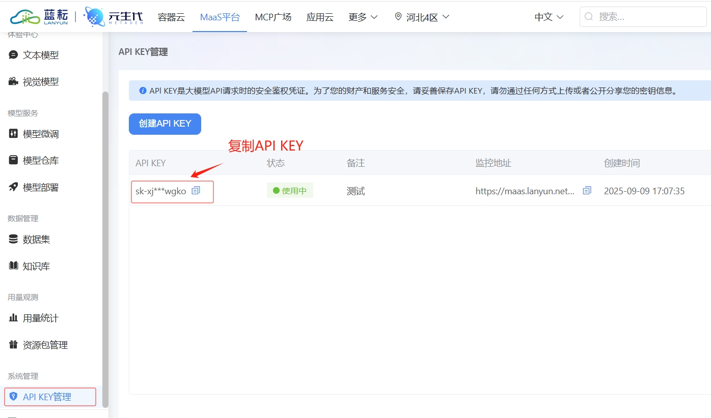
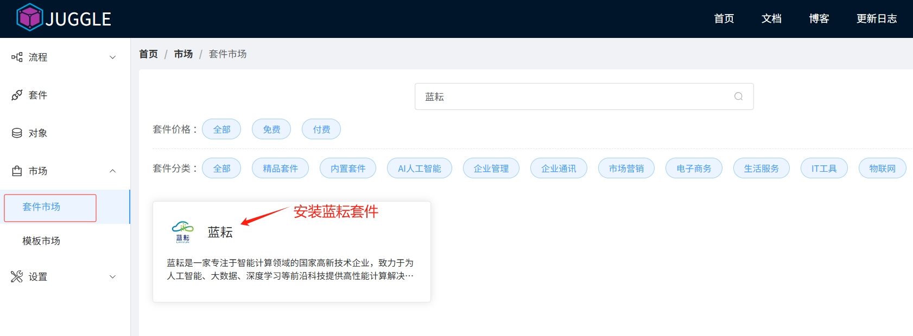
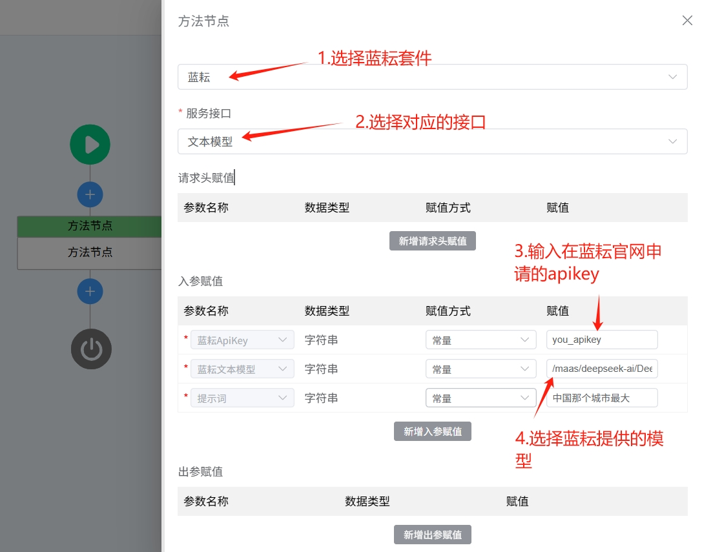

蓝耘是一家专注于智能计算领域的国家高新技术企业，致力于为人工智能、大数据、深度学习等前沿科技提供高性能计算解决方案。公司核心产品涵盖AI服务器、大模型平台、算力集群及私有云平台，具备强大的硬件研发与系统集成能力。

## 蓝耘如何获取ApiKey
1.前往蓝耘官方网站 [https://console.lanyun.net/#/register?promoterCode=0356e1fb44](https://console.lanyun.net/#/register?promoterCode=0356e1fb44)， 注册账号

2.登录后，在“API KEY管理”中点击“创建API KEY”，就可以在应用列表页面查看APIKEY

## 在Juggle中使用蓝耘套件

#### 1.安装蓝耘套件

进入 Juggle 套件市场，在套件市场中搜索**蓝耘**，安装蓝耘套件，后续就能在流程中使用蓝耘提供的接口了。

#### 2. 使用蓝耘接口

在流程中新建一个**方法节点**，在方法节点的设置中选择**蓝耘套件**，就可以选择蓝耘提供的文本模型，生成视频等各种接口了，基于这些接口能力，用户可以编排出各种场景的流程，来满足用户的不同场景的需求。
