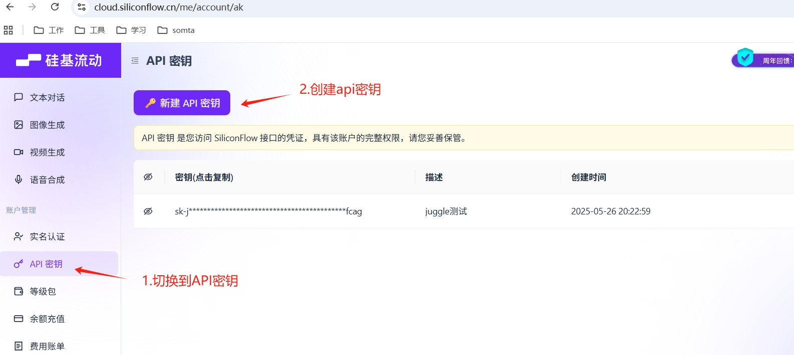
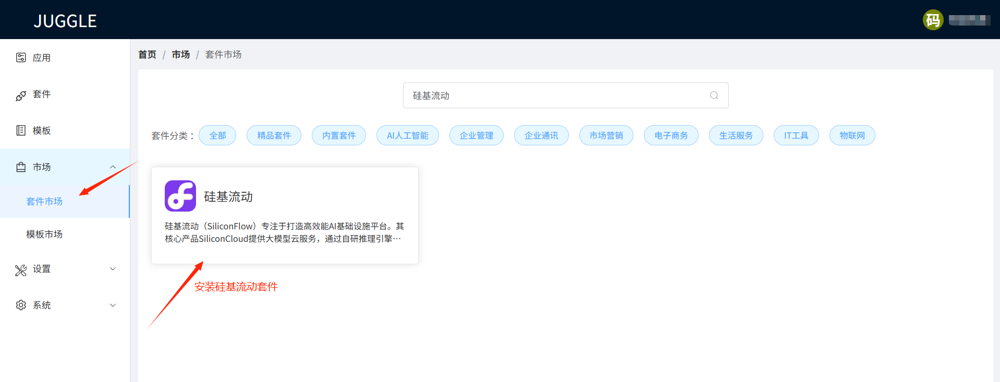
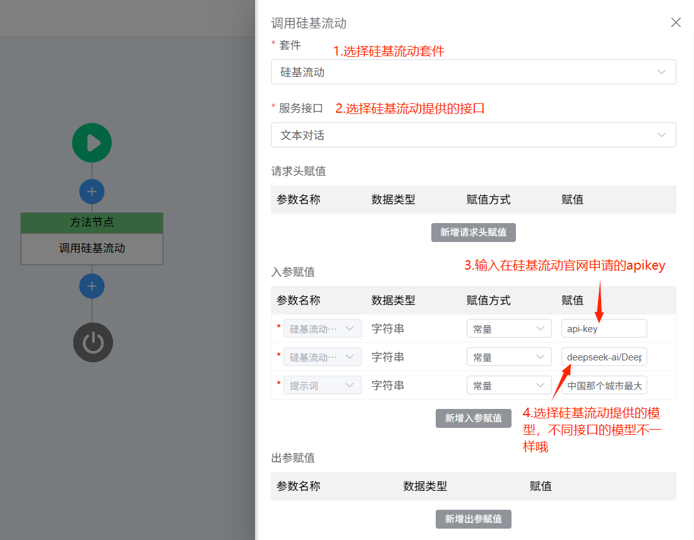

硅基流动（SiliconFlow）专注于打造高效能AI基础设施平台。其核心产品SiliconCloud提供大模型云服务，通过自研推理引擎加速AI应用部署，帮助企业及开发者降低算力成本，促进创新。

## 如何获取硅基流动的ApiKey

### 1.注册硅基流动账号

打开硅基流动官网 [https://cloud.siliconflow.cn/i/g0vSKS3N](https://cloud.siliconflow.cn/i/g0vSKS3N) 并注册账号（如果注册过，直接登录即可），完成注册后，打开[API密钥](https://cloud.siliconflow.cn/account/ak) ，创建新的 API Key，点击密钥进行复制，以备后续使用。

### 2.创建ApiKey

## 在Juggle中使用硅基流动
### 1.安装硅基流动套件
进入Juggle套件市场，在套件市场中搜索**硅基流动**，安装硅基流动套件，后续就能在流程中使用硅基流动提供的接口了。

### 2.使用硅基流动接口
在流程中新建一个**方法节点**，在方法节点的设置中选择**硅基流动套件**，就可以选择硅基流动提供的文本对话，生成图片，生成视频等各种接口了，基于这些接口能力，用户可以编排出各种场景的流程，来满足用户的不同场景的需求。

